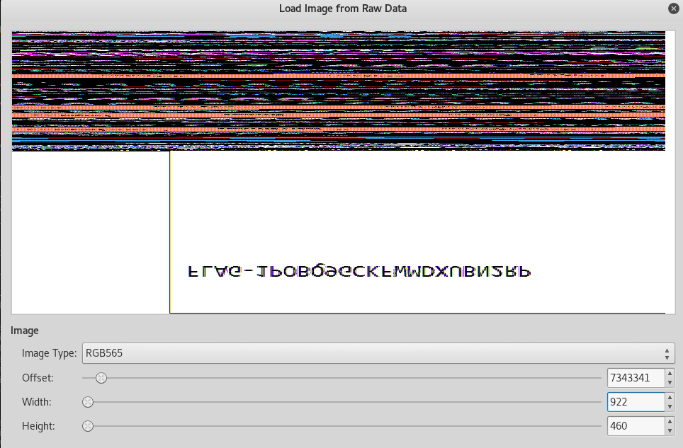

 # R.I.P MsPaint

 ## Challenge 269

In this challenge we are given a memory dump of a Windows machine.

First, we need to identify the Volatility profile using the *image info* command.

```
root@kali:~/Downloads# volatility -f flagdump.r0 imageinfo
Volatility Foundation Volatility Framework 2.6
INFO    : volatility.debug    : Determining profile based on KDBG search...
          Suggested Profile(s) : Win7SP1x64, Win7SP0x64, Win2008R2SP0x64, Win2008R2SP1x64_23418, Win2008R2SP1x64, Win7SP1x64_23418
                     AS Layer1 : WindowsAMD64PagedMemory (Kernel AS)
                     AS Layer2 : FileAddressSpace (/root/Downloads/flagdump.r0)
                      PAE type : No PAE
                           DTB : 0x187000L
                          KDBG : 0xf800029f20b0L
          Number of Processors : 1
     Image Type (Service Pack) : 1
                KPCR for CPU 0 : 0xfffff800029f3d00L
             KUSER_SHARED_DATA : 0xfffff78000000000L
           Image date and time : 2017-07-29 20:15:06 UTC+0000
     Image local date and time : 2017-07-29 16:15:06 -0400
```

Then, we'll look at the running processes.

```
root@kali:~/Downloads# volatility -f flagdump.r0 --profile Win7SP1x64 pslist
Volatility Foundation Volatility Framework 2.6
Offset(V)          Name                    PID   PPID   Thds     Hnds   Sess  Wow64 Start                          Exit                          
------------------ -------------------- ------ ------ ------ -------- ------ ------ ------------------------------ ------------------------------
0xfffffa8000c41740 System                    4      0     81      503 ------      0 2017-07-29 20:02:04 UTC+0000                                 
0xfffffa8001d86040 smss.exe                272      4      2       29 ------      0 2017-07-29 20:02:05 UTC+0000                                 
0xfffffa80024fbb30 csrss.exe               348    340      8      343      0      0 2017-07-29 20:02:10 UTC+0000                                 
0xfffffa8002520b30 csrss.exe               396    388      7      158      1      0 2017-07-29 20:02:11 UTC+0000                                 
0xfffffa8002527910 wininit.exe             404    340      3       74      0      0 2017-07-29 20:02:11 UTC+0000                                 
0xfffffa800253fb30 winlogon.exe            444    388      3      111      1      0 2017-07-29 20:02:11 UTC+0000                                 
0xfffffa800258fb30 services.exe            492    404      7      195      0      0 2017-07-29 20:02:12 UTC+0000                                 
0xfffffa80025a3b30 lsass.exe               500    404      7      543      0      0 2017-07-29 20:02:12 UTC+0000                                 
0xfffffa80025abb30 lsm.exe                 508    404     10      143      0      0 2017-07-29 20:02:12 UTC+0000                                 
0xfffffa80025a4b30 svchost.exe             612    492     10      343      0      0 2017-07-29 20:02:13 UTC+0000                                 
0xfffffa8002684b30 VBoxService.ex          672    492     11      116      0      0 2017-07-29 20:02:13 UTC+0000                                 
0xfffffa8000ca7b30 svchost.exe             724    492      6      245      0      0 2017-07-29 20:02:14 UTC+0000                                 
0xfffffa80027e5b30 svchost.exe             776    492     22      490      0      0 2017-07-29 20:02:14 UTC+0000                                 
0xfffffa800280f9e0 svchost.exe             856    492     12      306      0      0 2017-07-29 20:02:14 UTC+0000                                 
0xfffffa800283d290 svchost.exe             892    492     19      448      0      0 2017-07-29 20:02:14 UTC+0000                                 
0xfffffa8002825b30 svchost.exe             920    492     27      809      0      0 2017-07-29 20:02:14 UTC+0000                                 
0xfffffa80028c8890 svchost.exe             356    492      5      100      0      0 2017-07-29 20:02:16 UTC+0000                                 
0xfffffa80028f5060 svchost.exe             752    492     15      363      0      0 2017-07-29 20:02:16 UTC+0000                                 
0xfffffa80024e0340 spoolsv.exe            1108    492     12      263      0      0 2017-07-29 20:02:18 UTC+0000                                 
0xfffffa8002502060 svchost.exe            1136    492     17      305      0      0 2017-07-29 20:02:18 UTC+0000                                 
0xfffffa800260c340 taskhost.exe           1288    492      7      168      1      0 2017-07-29 20:02:19 UTC+0000                                 
0xfffffa8002a0e060 sppsvc.exe             1660    492      6      142      0      0 2017-07-29 20:02:22 UTC+0000                                 
0xfffffa800261b060 dwm.exe                1232    856      3       71      1      0 2017-07-29 20:02:56 UTC+0000                                 
0xfffffa800262d110 explorer.exe           1380   1156     23      674      1      0 2017-07-29 20:02:56 UTC+0000                                 
0xfffffa8002c85930 VBoxTray.exe           1704   1380     13      154      1      0 2017-07-29 20:02:57 UTC+0000                                 
0xfffffa8002ce2060 SearchIndexer.         1952    492     12      554      0      0 2017-07-29 20:03:03 UTC+0000                                 
0xfffffa8002d94060 wmpnetwk.exe           2028    492     10      213      0      0 2017-07-29 20:03:03 UTC+0000                                 
0xfffffa8002da1b30 svchost.exe            1168    492     12      211      0      0 2017-07-29 20:03:04 UTC+0000                                 
0xfffffa8002b19060 mspaint.exe            2332   1380      6      137      1      0 2017-07-29 20:03:34 UTC+0000                                 
0xfffffa80025c1060 svchost.exe            2360    492      6      101      0      0 2017-07-29 20:03:35 UTC+0000                                 
0xfffffa8000e31b30 svchost.exe            2600    492     11      320      0      0 2017-07-29 20:04:21 UTC+0000                                 
0xfffffa8000da2060 WmiPrvSE.exe           2108    612      6      109      0      0 2017-07-29 20:06:24 UTC+0000                                 
0xfffffa8000ea3b30 audiodg.exe            2804    776      4      120      0      0 2017-07-29 20:09:31 UTC+0000
```

Since the title of the challenge is RIP MsPaint, we'll extract the memory from the MsPaint process.

```
root@kali:~/Downloads# volatility -f flagdump.r0 --profile Win7SP1x64 memdump -n mspaint.exe --dump-dir dump
Volatility Foundation Volatility Framework 2.6
************************************************************************
Writing mspaint.exe [  2332] to 2332.dmp
```

Then open the image with GIMP, setting the image type to RAW.

Once the image is opened, we need to play with the offset, height and width until we find something.



Here's the flag.


